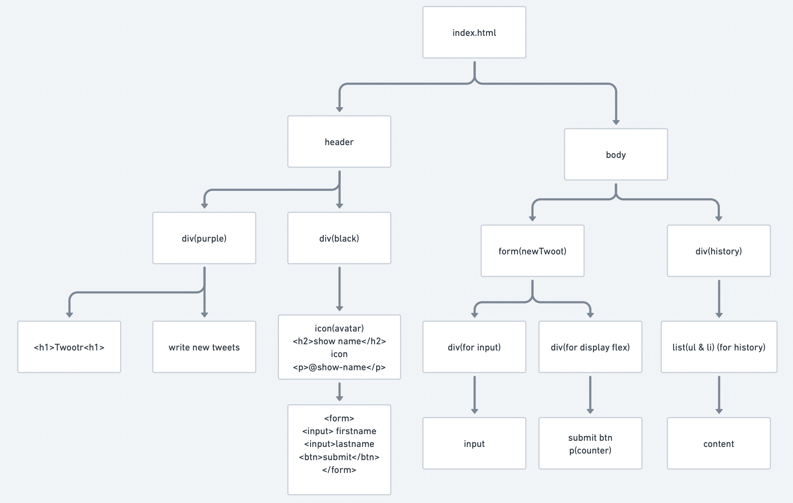
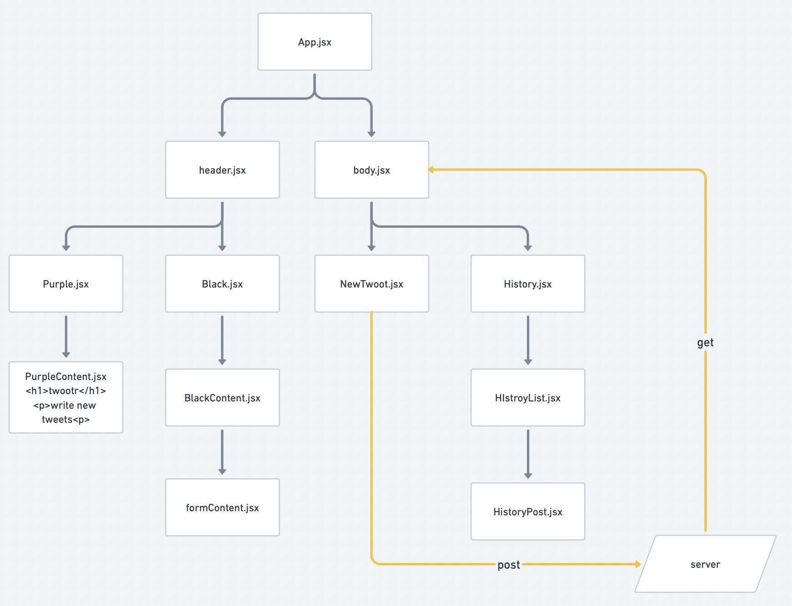

# HTML Structure

# Component Structure

# Style

-   Colors:

    -   Navbar / Button : `#711a75`
    -   Background Header : `#413f42`
    -   Background Main : `#f4f1ec`
    -   Active Icons : `f73d93`
    -   Font / Box shadow : `#888888`

-   Fonts (Google):
    -   Logo / Button : Permanent Marker
    -   Main : Kanit
